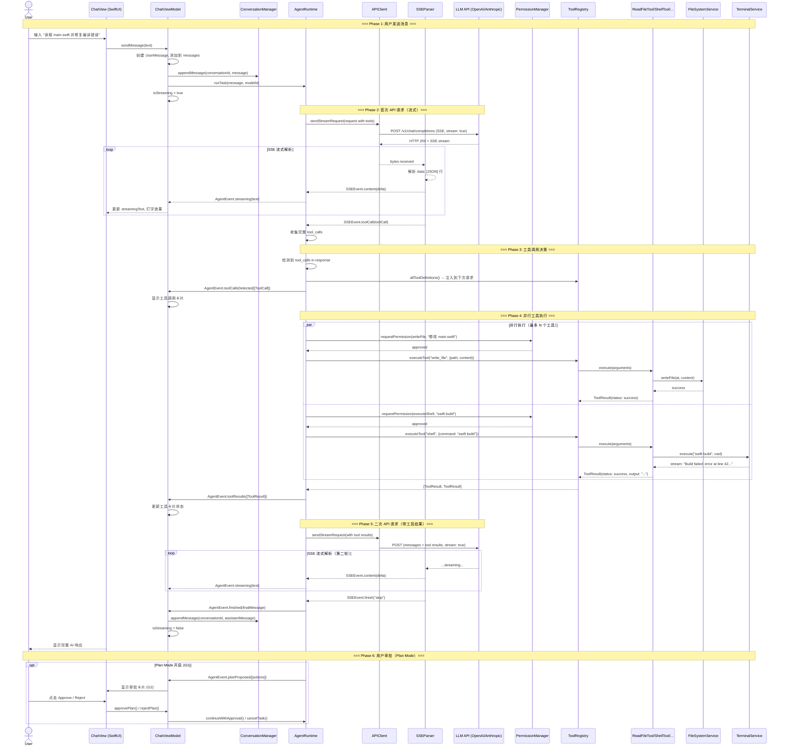
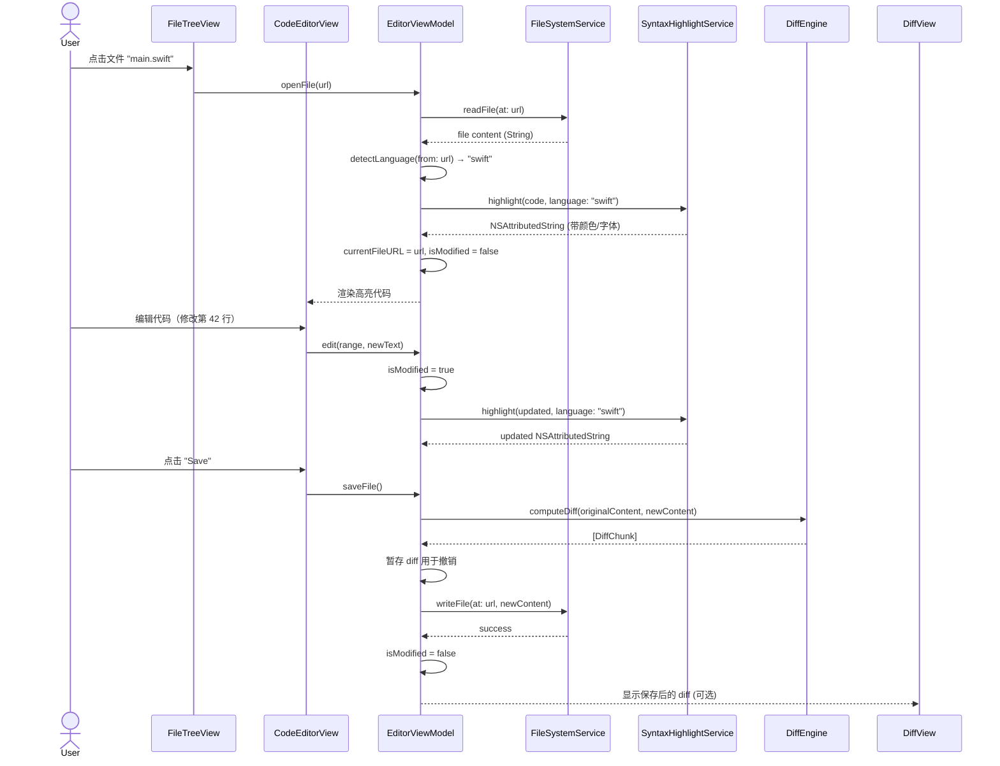
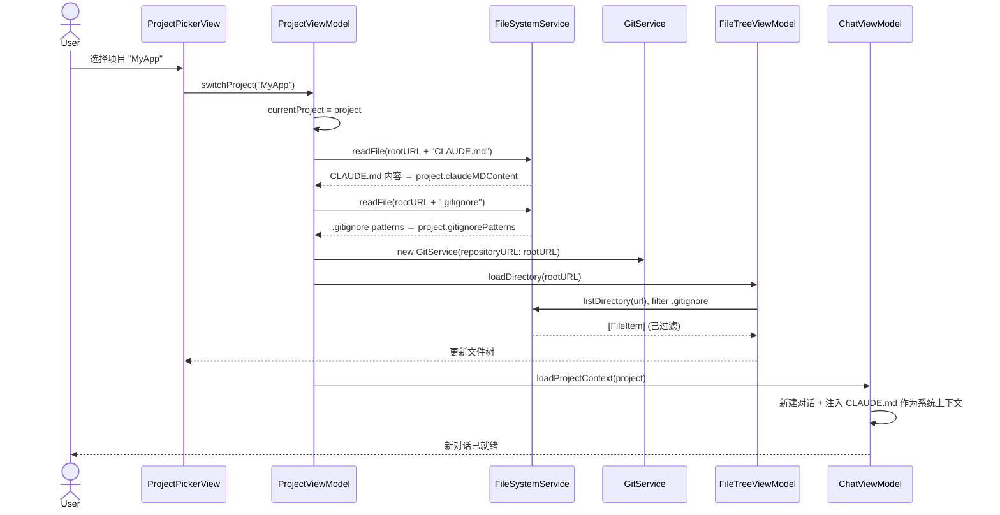
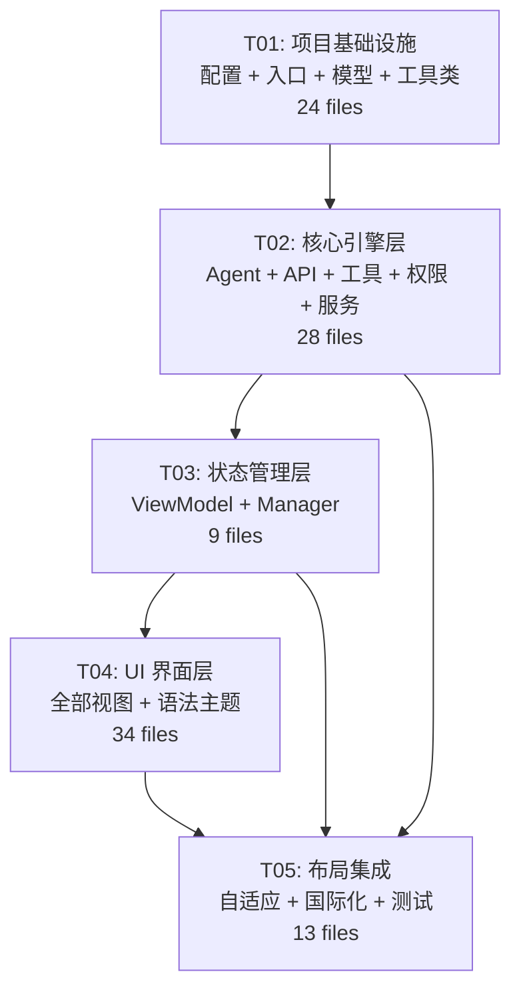

# iOS AI 编程 Agent 应用 — 系统架构设计

> **架构师**: Bob (软件架构师)  
> **项目名**: ios-agent-app  
> **目标平台**: iOS 16+, SwiftUI + UIKit 混合  
> **对标产品**: Claude Code（完整 GUI 化）

---

## 目录

- [Part A: 系统设计](#part-a-系统设计)
  - [1. 实现方案与框架选型](#1-实现方案与框架选型)
  - [2. 文件列表](#2-文件列表)
  - [3. 数据结构和接口](#3-数据结构和接口)
  - [4. 程序调用流程](#4-程序调用流程)
  - [5. 待明确事项](#5-待明确事项)
- [Part B: 任务分解](#part-b-任务分解)
  - [6. 依赖包列表](#6-依赖包列表)
  - [7. 任务列表](#7-任务列表)
  - [8. 共享知识](#8-共享知识)
  - [9. 任务依赖图](#9-任务依赖图)

---

# Part A: 系统设计

## 1. 实现方案与框架选型

### 1.1 核心架构决策

| 决策点 | 选择 | 理由 |
|--------|------|------|
| **架构模式** | MVVM + Coordinator | SwiftUI 原生支持 `@Observable`/`@StateObject`，MVVM 符合单向数据流；Coordinator 负责导航解耦 |
| **UI 框架** | SwiftUI 为主 + UIKit 包裹 | 终端模拟器、高级文本编辑器需要 UIKit 的 `UITextView`/`NSTextStorage` 精细控制 |
| **响应式框架** | Combine | Apple 原生、与 SwiftUI 无缝集成、适合处理 SSE 流式数据 |
| **持久化** | SwiftData (iOS 17+) + UserDefaults (兼容层) | SwiftData 为 Apple 推荐的现代持久化方案；P0 阶段主要用 UserDefaults + 文件系统存储 |
| **依赖注入** | 手动构造注入 + `@EnvironmentObject` | 避免引入重型 DI 框架，保持简单 |

### 1.2 关键技术选型

#### AI API 通信 — URLSession SSE

```
LLM Providers (OpenAI / Anthropic / ...)
        ↑ HTTPS SSE (stream: true)
APIClient (URLSession bytes delegate)
        ↓ PassthroughSubject<SSEEvent, Never>
SSEParser (状态机解析 data: [JSON] 行)
        ↓ AnyPublisher<AgentMessage, Error>
AgentRuntime (协调器)
```

- `URLSession.dataTask(with: delegate:)` + 自定义 `URLSessionDataDelegate`
- 逐字节解析 SSE 协议（`data:`, `event:`, `id:` 行），状态机处理 `[DONE]` 终止符
- Sendable `AsyncStream<SSEEvent>` 暴露给 SwiftUI 消费

#### Git 操作 — SwiftGit2 (libgit2 Swift 绑定)

- 社区维护的 [SwiftGit2](https://github.com/SwiftGit2/SwiftGit2) 封装 libgit2
- 若 SwiftGit2 稳定性不足，备选：直接调用 `/usr/bin/git`（越狱/企业内部签名场景），P0 阶段先用 Process 调用 git CLI 兜底

#### 终端执行 — Process API

- `Process()` + `Pipe()` + `FileHandle.readabilityHandler`
- 受限执行环境：禁用 `sudo`、网络外连白名单、工作目录锁定项目根目录
- 输出通过 `CurrentValueSubject<String, Never>` 实时推送

#### 语法高亮 — tree-sitter

- [tree-sitter](https://tree-sitter.github.io/) 的原生 Swift 封装（或直接使用 [Neon](https://github.com/ChimeHQ/Neon) / [Highlighter](https://github.com/simonbs/Highlighter)）
- 支持 50+ 语言的增量解析（编辑时只重新解析修改部分）
- 渲染：`NSAttributedString` + `NSTextStorage`，通过 `UIViewRepresentable` 嵌入 SwiftUI

#### Diff 计算 — 自研简化 Myers Diff

- Input: 两个 `String`（old/new）
- Output: `[DiffChunk]`（add/delete/context 行 + 行号映射）
- P0 不引入完整 diff 库，先用 Myers 算法的小型纯 Swift 实现

### 1.3 模块分层架构

```
┌─────────────────────────────────────────────────────────┐
│                     UI 层 (SwiftUI + UIKit)              │
│  ┌──────┬──────┬──────┬──────┬──────┬──────┬──────────┐ │
│  │ Chat │Editor│ Diff │FileTr│Term  │ Tools│ Settings │ │
│  └──────┴──────┴──────┴──────┴──────┴──────┴──────────┘ │
├─────────────────────────────────────────────────────────┤
│                    ViewModel 层                          │
│  ┌──────────┬──────────┬──────────┬───────────────────┐ │
│  │ ChatVM   │ EditorVM │ FileTreeVM│ TerminalVM       │ │
│  └──────────┴──────────┴──────────┴───────────────────┘ │
├─────────────────────────────────────────────────────────┤
│                     Core 层                              │
│  ┌──────────┬──────────┬──────────┬───────────────────┐ │
│  │ Agent    │ APIClient│ ToolReg  │ PermissionMgr     │ │
│  └──────────┴──────────┴──────────┴───────────────────┘ │
├─────────────────────────────────────────────────────────┤
│                    Services 层                           │
│  ┌──────┬──────┬──────────┬──────────┬──────────┬─────┐ │
│  │FileSys│ Git  │ Terminal │ SyntaxHi │ DiffEng  │Srch │ │
│  └──────┴──────┴──────────┴──────────┴──────────┴─────┘ │
├─────────────────────────────────────────────────────────┤
│                    Models 层                             │
│  ┌──────────┬──────────┬──────────┬───────────────────┐ │
│  │Conversatn│ Message  │ Project  │ FileItem          │ │
│  └──────────┴──────────┴──────────┴───────────────────┘ │
├─────────────────────────────────────────────────────────┤
│                    Utils + Extensions                    │
└─────────────────────────────────────────────────────────┘
```

### 1.4 自适应布局策略

```
iPhone (紧凑宽度):
  TabView(3 tabs)
    Tab 1: ChatView
    Tab 2: FileTreeView + CodeEditorView (NavigationStack)
    Tab 3: TerminalView + GitView (NavigationStack)

iPad (常规宽度):
  HStack {
    FileTreeView       .frame(width: 250)
    CodeEditorView     .frame(maxWidth: .infinity)
    ChatView           .frame(width: 350)
  }
  .overlay(alignment: .bottom) { ToolbarView() }
```

使用 `@Environment(\.horizontalSizeClass)` 判断布局模式，`ViewThatFits` 辅助自适应。

### 1.5 P1/P2 扩展点预留

| 扩展点 | 预留方式 |
|--------|----------|
| MCP 协议 (P2) | `ToolProtocol` 协议设计为可序列化，支持动态注册工具 |
| Channels/子代理 (P2) | `AgentRuntime` 设计为多实例可并存，每个实例独立上下文 |
| 后台任务 (P1) | `AgentTask` 遵循 `Identifiable` + `Codable`，可被 BGTaskScheduler 调度 |
| 撤销/重做 (P1) | `UndoManager` 集成到 `EditorViewModel` |
| Skills/Hooks (P2) | 预留 `SkillPlugin` 和 `HookPlugin` 协议 |
| SSH 远程 (P2) | `TerminalService` 抽象为 `TerminalProvider` 协议，可替换为 SSH 实现 |

---

## 2. 文件列表

> 共 **72 个源文件**，覆盖 P0 全部 27 项功能（A1-A6, B1-B6, C1-C4, D1-D2, E1-E3, F1-F3, G1-G2, H1-H2, I1-I2, J1-J2）

```
ios-agent-app/
│
├── Package.swift                          # SPM 包定义（依赖 + target）
├── project.yml                            # XcodeGen 项目配置（可选）
├── .swiftlint.yml                         # 代码风格检查
│
├── Sources/
│   │
│   ├── App/                               # 📦 应用入口与全局状态
│   │   ├── AppMain.swift                  # @main 入口 (G1 规划模式入口)
│   │   ├── AppDelegate.swift              # UIApplicationDelegate (UIKit 桥接)
│   │   ├── AppState.swift                 # 全局 ObservableObject (J1 深色/浅色, J2 语言)
│   │   └── AppConstants.swift             # API endpoints, 默认模型名, 版本号
│   │
│   ├── Core/                              # 🧠 核心引擎
│   │   ├── Agent/
│   │   │   ├── AgentRuntime.swift         # Agent 主循环：接收消息 → 调用 API → 执行工具 → 返回结果 (A1-A3, H1)
│   │   │   ├── AgentTask.swift            # 单次对话任务封装 (G1 规划任务)
│   │   │   ├── AgentMessage.swift         # 消息模型：user/assistant/system/tool
│   │   │   └── ToolCall.swift             # AI 返回的工具调用结构 (H1 多工具并行)
│   │   │
│   │   ├── API/
│   │   │   ├── APIClient.swift            # HTTP SSE 客户端 (A2 流式响应)
│   │   │   ├── SSEParser.swift            # SSE 协议解析器 (A2)
│   │   │   ├── APIRequest.swift           # 请求构造 (A6 多模型切换, A5 System Prompt)
│   │   │   └── APIModels.swift            # API 响应模型 (ChatCompletion, Choice, Delta)
│   │   │
│   │   ├── Tools/                         # 🔧 工具系统 (H1 多工具并行, H2 可视化)
│   │   │   ├── ToolProtocol.swift         # 工具协议定义
│   │   │   ├── ToolRegistry.swift         # 工具注册与调度
│   │   │   ├── ReadFileTool.swift         # B1 读文件
│   │   │   ├── WriteFileTool.swift        # B1 写文件
│   │   │   ├── EditFileTool.swift         # B1 编辑文件
│   │   │   ├── ShellTool.swift            # D1 Shell 命令
│   │   │   ├── GlobTool.swift             # C2 Glob 搜索
│   │   │   ├── GrepTool.swift             # C3 Grep 搜索
│   │   │   ├── FileTreeTool.swift         # C1 文件树
│   │   │   ├── GitStatusTool.swift        # F1 Git 状态
│   │   │   ├── GitCommitTool.swift        # F2 创建提交
│   │   │   └── GitDiffTool.swift          # F3 Diff 查看
│   │   │
│   │   └── Permissions/
│   │       ├── PermissionManager.swift    # 权限管理器 (I1 敏感操作确认, I2 沙箱)
│   │       └── PermissionScope.swift      # 权限域定义 (read/write/shell/git)
│   │
│   ├── Services/                          # 🔌 业务服务层
│   │   ├── FileSystemService.swift        # 文件读写/删除/创建 (C4, B1-B3)
│   │   ├── GitService.swift               # Git 操作封装 (F1-F3)
│   │   ├── TerminalService.swift          # 终端命令执行 (D1-D2)
│   │   ├── SyntaxHighlightService.swift   # 语法高亮引擎 (B4 50+语言)
│   │   ├── DiffEngine.swift               # Diff 计算引擎 (B5 Diff视图)
│   │   └── SearchService.swift            # 搜索合并 (C2+C3 统一搜索入口)
│   │
│   ├── Models/                            # 📊 数据模型
│   │   ├── Conversation.swift             # 对话模型 (A4 对话历史管理)
│   │   ├── Message.swift                  # 消息模型 (A1 多轮对话, A3 上下文)
│   │   ├── Project.swift                  # 项目模型 (E1 多项目, E3 CLAUDE.md)
│   │   ├── FileItem.swift                 # 文件节点模型 (C1 文件树)
│   │   ├── ToolResult.swift               # 工具执行结果 (H2 可视化)
│   │   ├── DiffChunk.swift                # Diff 块模型 (B5)
│   │   ├── AppSettings.swift              # 应用设置 (J1, J2, A5, A6)
│   │   └── UserPreferences.swift          # 用户偏好 (持久化)
│   │
│   ├── ViewModels/                        # 🎯 视图模型
│   │   ├── ChatViewModel.swift            # 对话界面 VM (A1-A6)
│   │   ├── ConversationManager.swift      # 对话管理器 (A4 历史)
│   │   ├── EditorViewModel.swift          # 编辑器 VM (B1-B6)
│   │   ├── FileTreeViewModel.swift        # 文件树 VM (C1-C4)
│   │   ├── ToolCallViewModel.swift        # 工具调用 VM (H2 可视化)
│   │   ├── TerminalViewModel.swift        # 终端 VM (D1-D2)
│   │   ├── ProjectViewModel.swift         # 项目管理 VM (E1-E3)
│   │   ├── DiffViewModel.swift            # Diff VM (B5, F3)
│   │   └── SettingsViewModel.swift        # 设置 VM (J1, J2, A5, A6, I1)
│   │
│   ├── Views/                             # 🖼️ 视图层
│   │   ├── Main/
│   │   │   ├── ContentView.swift          # 根视图（自适应路由）
│   │   │   ├── iPhoneLayoutView.swift     # iPhone Tab 布局
│   │   │   └── iPadLayoutView.swift       # iPad 三面板布局
│   │   │
│   │   ├── Chat/                          # 💬 对话 (A1-A6)
│   │   │   ├── ChatView.swift             # 对话主视图
│   │   │   ├── MessageBubble.swift        # 消息气泡
│   │   │   ├── MessageInputView.swift     # 输入框（文本+附件）
│   │   │   ├── StreamingTextView.swift    # 流式文本渲染 (A2)
│   │   │   ├── ModelPickerView.swift      # 模型选择器 (A6)
│   │   │   └── SystemPromptEditor.swift   # System Prompt 编辑器 (A5)
│   │   │
│   │   ├── Editor/                        # 📝 代码编辑 (B1-B4, B6)
│   │   │   ├── CodeEditorView.swift       # 代码编辑器（UIKit 包裹）
│   │   │   ├── SyntaxHighlightView.swift  # 语法高亮渲染层 (B4)
│   │   │   └── LineNumberView.swift       # 行号视图
│   │   │
│   │   ├── Diff/                          # 📊 Diff (B5, F3)
│   │   │   ├── DiffView.swift             # Diff 主视图
│   │   │   ├── DiffLineView.swift         # 单行 Diff 渲染
│   │   │   └── DiffToolbar.swift          # Diff 工具栏（接受/拒绝）
│   │   │
│   │   ├── FileTree/                      # 📁 文件树 (C1-C4)
│   │   │   ├── FileTreeView.swift         # 文件树主视图 (C1)
│   │   │   ├── FileTreeNode.swift         # 树节点视图
│   │   │   └── FileTreeContextMenu.swift  # 右键菜单 (C4 创建/删除)
│   │   │
│   │   ├── Terminal/                      # 💻 终端 (D1-D2)
│   │   │   ├── TerminalView.swift         # 终端主视图 (D1)
│   │   │   └── TerminalOutputView.swift   # 输出渲染 (D2 实时输出)
│   │   │
│   │   ├── Tools/                         # 🔧 工具可视化 (H2)
│   │   │   ├── ToolCallCard.swift         # 工具调用卡片
│   │   │   ├── ToolApprovalSheet.swift    # 审批弹窗 (I1, G2)
│   │   │   └── ToolProgressView.swift     # 并行工具进度 (H1)
│   │   │
│   │   ├── Git/                           # 🌿 Git (F1-F3)
│   │   │   ├── GitStatusView.swift        # Git 状态视图 (F1)
│   │   │   ├── GitCommitView.swift        # 提交视图 (F2)
│   │   │   └── GitDiffBrowserView.swift   # Diff 浏览器 (F3)
│   │   │
│   │   ├── Project/                       # 📦 项目 (E1-E3)
│   │   │   ├── ProjectPickerView.swift    # 项目选择器 (E1)
│   │   │   └── ProjectSettingsView.swift  # 项目设置 (E3 CLAUDE.md)
│   │   │
│   │   ├── Settings/                      # ⚙️ 设置 (J1, J2, A5, A6, I1)
│   │   │   ├── SettingsView.swift         # 设置主视图 (J1 深色/浅色, J2 语言)
│   │   │   └── APIKeyConfigView.swift     # API Key 配置
│   │   │
│   │   └── Common/                        # 🧩 通用组件
│   │       ├── ToolbarView.swift          # 底部工具栏
│   │       ├── SearchBarView.swift        # 搜索栏
│   │       ├── PlaceholderView.swift      # 空状态占位
│   │       ├── LoadingIndicator.swift     # 加载指示器
│   │       └── ConfirmDialog.swift        # 通用确认弹窗 (I1)
│   │
│   └── Utils/                             # 🛠 工具类
│       ├── Extensions/
│       │   ├── String+Extensions.swift    # 字符串扩展
│       │   ├── Color+Extensions.swift     # 颜色扩展 (J1 深色/浅色适配)
│       │   ├── View+Extensions.swift      # View 扩展
│       │   └── FileManager+Extensions.swift # 文件管理扩展
│       ├── KeychainHelper.swift           # Keychain 安全存储 API Key
│       ├── Logger.swift                   # 统一日志
│       └── Debouncer.swift                # 防抖工具（搜索输入）
│
├── Resources/
│   ├── Assets.xcassets/                   # 图片资源
│   │   ├── AppIcon.appiconset/
│   │   └── AccentColor.colorset/
│   ├── Localizable.strings                # 英文本地化 (J2)
│   ├── Localizable_zh-Hans.strings        # 中文本地化 (J2)
│   ├── syntax_themes/
│   │   ├── default_light.json             # 浅色语法主题
│   │   └── default_dark.json              # 深色语法主题
│   └── Info.plist                         # 应用配置
│
└── Tests/                                 # 🧪 测试
    ├── Core/
    │   ├── APIClientTests.swift
    │   ├── SSEParserTests.swift
    │   └── ToolRegistryTests.swift
    ├── Services/
    │   ├── FileSystemServiceTests.swift
    │   ├── DiffEngineTests.swift
    │   └── SearchServiceTests.swift
    └── ViewModels/
        ├── ChatViewModelTests.swift
        └── EditorViewModelTests.swift
```

### 文件统计

| 模块 | 文件数 | 覆盖的 P0 功能 |
|------|--------|---------------|
| App/ | 4 | J1, J2, G1 |
| Core/Agent/ | 4 | A1-A3, H1, G1 |
| Core/API/ | 4 | A2, A5, A6 |
| Core/Tools/ | 12 | B1, C1-C3, D1, F1-F3, H1 |
| Core/Permissions/ | 2 | I1, I2 |
| Services/ | 6 | B1-B5, C2-C4, D1-D2, F1-F3 |
| Models/ | 8 | A1, A3, A4, B5, C1, E1, E3, H2, J1, J2 |
| ViewModels/ | 9 | A1-A6, B1-B6, C1-C4, D1-D2, E1-E3, F1-F3, G1-G2, H1-H2, I1, J1-J2 |
| Views/ | 34 | A1-A6, B1-B6, C1-C4, D1-D2, E1-E3, F1-F3, G1-G2, H1-H2, I1, J1-J2 |
| Utils/ | 8 | 基础设施 |
| Resources/ | 5+ | J1, J2 |
| **合计** | **~96 (含资源)** | P0 全部 27 项 |

---

## 3. 数据结构和接口

### 3.1 Mermaid 类图

> 完整类图另存为 `docs/class-diagram.mermaid`

```mermaid
classDiagram
    direction TB

    %% ── Models ──
    class Conversation {
        +String id
        +String title
        +[Message] messages
        +Date createdAt
        +Date updatedAt
        +String modelId
        +String systemPrompt
        +Bool isArchived
    }

    class Message {
        +String id
        +MessageRole role
        +String content
        +[ToolCall] toolCalls
        +String toolCallId
        +Date timestamp
        +TokenUsage tokenUsage
    }

    class Project {
        +String id
        +String name
        +URL rootURL
        +String claudeMDContent
        +[String] gitignorePatterns
        +Date lastOpened
    }

    class FileItem {
        +String id
        +String name
        +URL url
        +Bool isDirectory
        +[FileItem] children
        +Int64 fileSize
        +Date modificationDate
    }

    class ToolResult {
        +String toolCallId
        +String toolName
        +ToolResultStatus status
        +String output
        +String errorMessage
        +Date executedAt
        +Int durationMs
    }

    class DiffChunk {
        +String id
        +DiffChunkType type
        +[DiffLine] lines
        +Int oldStartLine
        +Int newStartLine
    }

    class DiffLine {
        +String content
        +DiffLineType type
        +Int oldLineNumber
        +Int newLineNumber
    }

    class AppSettings {
        +AppTheme theme
        +AppLanguage language
        +String defaultModelId
        +String openAIAPIKey
        +String anthropicAPIKey
        +String openAIBaseURL
        +Bool planModeEnabled
        +[String] trustedPaths
    }

    class UserPreferences {
        +Bool autoApproveReadOnly
        +Bool showLineNumbers
        +Int fontSize
        +String fontFamily
        +Bool wordWrap
    }

    %% ── Core: Agent ──
    class AgentRuntime {
        -APIClient apiClient
        -ToolRegistry toolRegistry
        -PermissionManager permissionMgr
        -ConversationManager conversationMgr
        +runTask(message, modelId) AsyncStream~AgentEvent~
        +cancelCurrentTask()
        +executeTools(toolCalls) [ToolResult]
    }

    class AgentTask {
        +String id
        +AgentTaskStatus status
        +Conversation conversation
        +[ToolCall] pendingToolCalls
        +[ToolResult] toolResults
        +Date startedAt
        +cancel()
    }

    class ToolCall {
        +String id
        +String name
        +[String: AnyCodable] arguments
        +String callId
    }

    class AgentMessage {
        +String id
        +AgentMessageRole role
        +String content
        +[ToolCall] toolCalls
        +String finishReason
    }

    %% ── Core: API ──
    class APIClient {
        -URLSession session
        -SSEParser parser
        +sendStreamRequest(request) AsyncStream~SSEEvent~
        +sendRequest(request) AnyPublisher~Data, Error~
        +cancelAllRequests()
    }

    class SSEParser {
        -Data buffer
        +parse(bytes) [SSEEvent]
        +reset()
    }

    class APIRequest {
        +String model
        +[APIMessage] messages
        +[ToolDefinition] tools
        +Bool stream
        +Int maxTokens
        +Double temperature
        +String systemPrompt
        -toURLRequest(apiKey, baseURL) URLRequest
    }

    class APIModels {
        +ChatCompletionResponse
        +ChatCompletionChoice
        +ChatCompletionDelta
        +ToolDefinition
        +FunctionDefinition
    }

    %% ── Core: Tools ──
    class ToolProtocol {
        <<protocol>>
        +String name
        +String description
        +JSONSchema parameters
        +Bool requiresApproval
        +PermissionScope permissionScope
        +execute(arguments) ToolResult
        +toolDefinition() ToolDefinition
    }

    class ToolRegistry {
        -[String: ToolProtocol] tools
        +register(tool)
        +unregister(name)
        +getTool(name) ToolProtocol?
        +allToolDefinitions() [ToolDefinition]
        +executeTool(name, arguments) ToolResult
    }

    class ReadFileTool {
        -FileSystemService fs
        +execute(arguments) ToolResult
    }

    class WriteFileTool {
        -FileSystemService fs
        +execute(arguments) ToolResult
    }

    class EditFileTool {
        -FileSystemService fs
        -DiffEngine diffEngine
        +execute(arguments) ToolResult
    }

    class ShellTool {
        -TerminalService terminal
        +execute(arguments) ToolResult
    }

    class GlobTool {
        -SearchService search
        +execute(arguments) ToolResult
    }

    class GrepTool {
        -SearchService search
        +execute(arguments) ToolResult
    }

    class FileTreeTool {
        -FileSystemService fs
        +execute(arguments) ToolResult
    }

    class GitStatusTool {
        -GitService git
        +execute(arguments) ToolResult
    }

    class GitCommitTool {
        -GitService git
        +execute(arguments) ToolResult
    }

    class GitDiffTool {
        -GitService git
        +execute(arguments) ToolResult
    }

    %% ── Core: Permissions ──
    class PermissionManager {
        -[String: PermissionRule] rules
        +requestPermission(scope, description) Bool
        +isAllowed(scope) Bool
        +grantTemporary(scope, duration)
        +revokeAll()
    }

    class PermissionScope {
        <<enum>>
        readFile
        writeFile
        deleteFile
        executeShell
        gitRead
        gitWrite
        networkOutbound
    }

    %% ── Services ──
    class FileSystemService {
        -FileManager fileManager
        +readFile(at) String
        +writeFile(at, content)
        +createDirectory(at)
        +deleteItem(at)
        +listDirectory(at) [FileItem]
        +fileExists(at) Bool
        +isTextFile(at) Bool
    }

    class GitService {
        -URL repositoryURL
        +status() GitStatus
        +diff(staged, file) String
        +commit(message, files) CommitResult
        +branches() [GitBranch]
        +currentBranch() String
        +log(count) [GitLogEntry]
    }

    class TerminalService {
        -Process currentProcess
        +execute(command, cwd) AsyncStream~TerminalOutput~
        +terminate()
        +isRunning() Bool
    }

    class SyntaxHighlightService {
        -[String: Highlighter] highlighters
        +highlight(code, language) NSAttributedString
        +registerLanguage(name, grammar)
        +supportedLanguages() [String]
    }

    class DiffEngine {
        +computeDiff(old, new) [DiffChunk]
        +applyPatch(original, chunks) String
        +unifiedDiff(old, new, contextLines) String
    }

    class SearchService {
        -FileSystemService fs
        +glob(pattern, root) [URL]
        +grep(pattern, root, fileTypes) [GrepMatch]
        +searchInFile(url, pattern) [GrepMatch]
    }

    %% ── ViewModels ──
    class ChatViewModel {
        -AgentRuntime agent
        -ConversationManager convMgr
        @Published [Message] messages
        @Published String inputText
        @Published Bool isStreaming
        @Published String streamingText
        +sendMessage()
        +cancelStreaming()
        +loadConversation(id)
        +newConversation()
    }

    class ConversationManager {
        -[Conversation] conversations
        +createConversation(modelId, systemPrompt) Conversation
        +getConversation(id) Conversation?
        +listConversations() [Conversation]
        +deleteConversation(id)
        +archiveConversation(id)
        +saveConversation(conversation)
    }

    class EditorViewModel {
        -FileSystemService fs
        @Published String fileContent
        @Published URL? currentFileURL
        @Published Bool isModified
        @Published String language
        @Published NSAttributedString highlightedContent
        +openFile(url)
        +saveFile()
        +edit(range, newText)
        +undo()
        +redo()
    }

    class FileTreeViewModel {
        -FileSystemService fs
        -SearchService search
        @Published [FileItem] rootItems
        @Published String searchQuery
        @Published [URL] searchResults
        +loadDirectory(url)
        +refresh()
        +globSearch(pattern)
        +grepSearch(pattern, fileTypes)
        +createFile(name, parent)
        +createDirectory(name, parent)
        +deleteItem(url)
    }

    class ToolCallViewModel {
        @Published [ToolCallState] activeTools
        +onToolCallStarted(call)
        +onToolCallCompleted(result)
        +onToolCallFailed(call, error)
        +approveTool(callId)
        +rejectTool(callId)
    }

    class TerminalViewModel {
        -TerminalService terminal
        @Published [String] outputLines
        @Published Bool isRunning
        @Published String currentCommand
        +executeCommand(cmd)
        +terminate()
    }

    class ProjectViewModel {
        @Published [Project] projects
        @Published Project? currentProject
        +openProject(url)
        +switchProject(id)
        +loadCLAUDE MD(url)
        +saveCLAUDE MD(content)
        +closeProject()
    }

    class DiffViewModel {
        -DiffEngine diffEngine
        @Published [DiffChunk] chunks
        @Published DiffViewMode mode
        +computeDiff(old, new)
        +acceptChunk(id)
        +rejectChunk(id)
        +acceptAll()
        +rejectAll()
    }

    class SettingsViewModel {
        @Published AppSettings settings
        @Published UserPreferences preferences
        +updateTheme(theme)
        +updateLanguage(language)
        +updateAPIKey(provider, key)
        +updateModel(modelId)
        +saveSettings()
    }

    %% ── Relationships ──
    Conversation "1" --> "*" Message : contains
    Message "1" --> "*" ToolCall : has
    Conversation "1" --> "*" ToolResult : has
    Project "1" --> "*" FileItem : root directory
    DiffChunk "1" --> "*" DiffLine : contains
    AppSettings "1" --> "1" UserPreferences : contains

    AgentRuntime --> APIClient : uses
    AgentRuntime --> ToolRegistry : uses
    AgentRuntime --> PermissionManager : uses
    AgentRuntime --> ConversationManager : uses
    AgentRuntime ..> AgentTask : creates

    ToolRegistry --> ToolProtocol : registers
    ReadFileTool ..|> ToolProtocol
    WriteFileTool ..|> ToolProtocol
    EditFileTool ..|> ToolProtocol
    ShellTool ..|> ToolProtocol
    GlobTool ..|> ToolProtocol
    GrepTool ..|> ToolProtocol
    FileTreeTool ..|> ToolProtocol
    GitStatusTool ..|> ToolProtocol
    GitCommitTool ..|> ToolProtocol
    GitDiffTool ..|> ToolProtocol

    ReadFileTool --> FileSystemService
    WriteFileTool --> FileSystemService
    EditFileTool --> FileSystemService
    EditFileTool --> DiffEngine
    ShellTool --> TerminalService
    GlobTool --> SearchService
    GrepTool --> SearchService
    FileTreeTool --> FileSystemService
    GitStatusTool --> GitService
    GitCommitTool --> GitService
    GitDiffTool --> GitService

    ChatViewModel --> AgentRuntime
    ChatViewModel --> ConversationManager
    EditorViewModel --> FileSystemService
    EditorViewModel --> SyntaxHighlightService
    FileTreeViewModel --> FileSystemService
    FileTreeViewModel --> SearchService
    ToolCallViewModel --> AgentRuntime
    TerminalViewModel --> TerminalService
    ProjectViewModel --> FileSystemService
    ProjectViewModel --> GitService
    DiffViewModel --> DiffEngine
    SettingsViewModel --> AppSettings
    SettingsViewModel --> UserPreferences
    SettingsViewModel --> KeychainHelper
```



---

## 4. 程序调用流程

### 4.1 核心流程：用户发送消息 → AI 流式响应 → 工具调用 → 工具执行 → 最终响应

> 完整时序图另存为 `docs/sequence-diagram.mermaid`



### 4.2 打开文件 → 语法高亮 → 编辑 → Diff 流程



### 4.3 项目切换流程



---

## 5. 待明确事项

| # | 问题 | 当前假设 | 影响范围 |
|---|------|----------|----------|
| 1 | **API Key 存储安全性** | 使用 Keychain，不经过任何中间服务器 | `KeychainHelper.swift`, 安全审计 |
| 2 | **树状语法解析器 (tree-sitter) 的 Swift 集成** | 使用 SPM 引入 tree-sitter 的 C 库 + Swift 封装层 | `SyntaxHighlightService.swift` |
| 3 | **Git 操作：libgit2 绑定 vs CLI** | P0 优先使用 `Process` 调用 `/usr/bin/git`（更稳定），P1 迁移到 SwiftGit2 | `GitService.swift` |
| 4 | **SwiftData 最低版本** | iOS 17+ 才支持 SwiftData；P0 用 UserDefaults + 文件系统 JSON 持久化 | `ConversationManager.swift` 持久化层 |
| 5 | **SSE 断线重连机制** | 实现指数退避重连（最多 3 次），重连时携带已有 messages | `APIClient.swift` |
| 6 | **多模型 API 差异抽象** | OpenAI-compatible 作为基础协议，Anthropic 通过 adapter 适配 | `APIClient.swift`, `APIRequest.swift` |
| 7 | **文件编码检测** | 默认 UTF-8，检测 BOM，非 UTF-8 时尝试转换为 UTF-8 | `FileSystemService.swift` |
| 8 | **iPad 三面板布局的最小宽度** | iPad 横屏 ≥ 1024px 使用三面板，否则退化为 iPhone 布局 | `iPadLayoutView.swift` |
| 9 | **终端权限模型** | 首次执行命令弹出用户授权，可选"记住选择" | `PermissionManager.swift`, `I2` |
| 10 | **长文本性能** | 超过 10,000 行的文件使用虚拟滚动，tree-sitter 仅高亮可视区域 | `CodeEditorView.swift` |

---

# Part B: 任务分解

## 6. 依赖包列表

```swift
// Package.swift dependencies
dependencies: [
    // UI & 工具
    .package(url: "https://github.com/onevcat/Kingfisher", from: "7.0.0"),
        // 用途: 图片缓存（如需图片预览功能）

    // Git 操作 (P1 阶段启用)
    // .package(url: "https://github.com/SwiftGit2/SwiftGit2", from: "0.1.0"),
    //     // 用途: Git 操作的原生 Swift 绑定

    // 语法高亮 (tree-sitter)
    .package(url: "https://github.com/ChimeHQ/Neon", from: "0.5.0"),
        // 用途: tree-sitter 的 Swift 封装，语法高亮核心

    // Markdown 解析
    .package(url: "https://github.com/apple/swift-markdown", from: "0.3.0"),
        // 用途: 解析 AI 返回的 Markdown 格式消息
]
```

| 包名 | 版本 | 用途 | P0/P1 |
|------|------|------|-------|
| Neon (ChimeHQ) | ~0.5.0 | tree-sitter 语法高亮 Swift 封装 | P0 |
| swift-markdown (Apple) | ~0.3.0 | Markdown 渲染 AI 消息 | P0 |
| Kingfisher | ~7.0.0 | 图片缓存（可选） | P1 |

> **注意**: P0 阶段大部分功能使用 Foundation/Combine/SwiftUI 原生能力，外部依赖保持最小化。

---

## 7. 任务列表

### T01: 项目基础设施 + 数据模型 + 基础工具

| 属性 | 内容 |
|------|------|
| **Task ID** | T01 |
| **Task Name** | 项目基础设施（配置、入口、模型、工具类） |
| **Source Files** | `Package.swift`, `project.yml`, `.swiftlint.yml`, `Sources/App/AppMain.swift`, `Sources/App/AppDelegate.swift`, `Sources/App/AppState.swift`, `Sources/App/AppConstants.swift`, `Sources/Models/Conversation.swift`, `Sources/Models/Message.swift`, `Sources/Models/Project.swift`, `Sources/Models/FileItem.swift`, `Sources/Models/ToolResult.swift`, `Sources/Models/DiffChunk.swift`, `Sources/Models/AppSettings.swift`, `Sources/Models/UserPreferences.swift`, `Sources/Utils/Extensions/String+Extensions.swift`, `Sources/Utils/Extensions/Color+Extensions.swift`, `Sources/Utils/Extensions/View+Extensions.swift`, `Sources/Utils/Extensions/FileManager+Extensions.swift`, `Sources/Utils/KeychainHelper.swift`, `Sources/Utils/Logger.swift`, `Sources/Utils/Debouncer.swift`, `Resources/Info.plist`, `Resources/Assets.xcassets/` |
| **Dependencies** | 无 |
| **Priority** | P0 |
| **覆盖 PRD 功能** | J1 (深色/浅色主题定义), J2 (语言枚举), E1 (Project 模型), A1 (Message 模型), A4 (Conversation 模型), C1 (FileItem 模型), B5 (DiffChunk/DiffLine 模型), I1 (AppSettings 权限配置) |

### T02: 核心引擎 — Agent + API + 工具系统 + 权限 + 全部服务

| 属性 | 内容 |
|------|------|
| **Task ID** | T02 |
| **Task Name** | 核心引擎层（Agent 运行时、API 通信、工具系统、权限管理、全部业务服务） |
| **Source Files** | `Sources/Core/Agent/AgentRuntime.swift`, `Sources/Core/Agent/AgentTask.swift`, `Sources/Core/Agent/AgentMessage.swift`, `Sources/Core/Agent/ToolCall.swift`, `Sources/Core/API/APIClient.swift`, `Sources/Core/API/SSEParser.swift`, `Sources/Core/API/APIRequest.swift`, `Sources/Core/API/APIModels.swift`, `Sources/Core/Tools/ToolProtocol.swift`, `Sources/Core/Tools/ToolRegistry.swift`, `Sources/Core/Tools/ReadFileTool.swift`, `Sources/Core/Tools/WriteFileTool.swift`, `Sources/Core/Tools/EditFileTool.swift`, `Sources/Core/Tools/ShellTool.swift`, `Sources/Core/Tools/GlobTool.swift`, `Sources/Core/Tools/GrepTool.swift`, `Sources/Core/Tools/FileTreeTool.swift`, `Sources/Core/Tools/GitStatusTool.swift`, `Sources/Core/Tools/GitCommitTool.swift`, `Sources/Core/Tools/GitDiffTool.swift`, `Sources/Core/Permissions/PermissionManager.swift`, `Sources/Core/Permissions/PermissionScope.swift`, `Sources/Services/FileSystemService.swift`, `Sources/Services/GitService.swift`, `Sources/Services/TerminalService.swift`, `Sources/Services/SyntaxHighlightService.swift`, `Sources/Services/DiffEngine.swift`, `Sources/Services/SearchService.swift` |
| **Dependencies** | T01 |
| **Priority** | P0 |
| **覆盖 PRD 功能** | A2 (SSE 流式), A3 (上下文保持), A5 (System Prompt 注入), A6 (多模型切换), B1-B3 (读/写/编辑文件), C2 (Glob 搜索), C3 (Grep 搜索), C4 (文件创建/删除), D1-D2 (Shell 命令+实时输出), F1-F3 (Git 状态/提交/Diff), H1 (多工具并行), H2 (工具可视化基础), I1-I2 (权限/沙箱) |

### T03: 状态管理 — ViewModels + ConversationManager + ProjectManager

| 属性 | 内容 |
|------|------|
| **Task ID** | T03 |
| **Task Name** | 状态管理层（全部 ViewModel + 对话管理器 + 项目管理器） |
| **Source Files** | `Sources/ViewModels/ChatViewModel.swift`, `Sources/ViewModels/ConversationManager.swift`, `Sources/ViewModels/EditorViewModel.swift`, `Sources/ViewModels/FileTreeViewModel.swift`, `Sources/ViewModels/ToolCallViewModel.swift`, `Sources/ViewModels/TerminalViewModel.swift`, `Sources/ViewModels/ProjectViewModel.swift`, `Sources/ViewModels/DiffViewModel.swift`, `Sources/ViewModels/SettingsViewModel.swift` |
| **Dependencies** | T02 (需 Core 层全部可用) |
| **Priority** | P0 |
| **覆盖 PRD 功能** | A1-A6 (对话全链路 VM), B1-B6 (编辑 VM), C1-C4 (文件树 VM), D1-D2 (终端 VM), E1-E3 (项目 VM), F1-F3 (Diff VM 复用), G1 (Plan Mode 状态), G2 (审批状态), H2 (工具可视化 VM), I1 (权限确认 VM 桥接), J1-J2 (设置 VM) |

### T04: UI 界面层 — 全部视图 + 语法高亮渲染 + Diff 视图 + 文件树 + 终端

| 属性 | 内容 |
|------|------|
| **Task ID** | T04 |
| **Task Name** | UI 界面层（对话、编辑器、Diff、文件树、终端、工具卡片、Git、项目、设置、通用组件） |
| **Source Files** | `Sources/Views/Chat/ChatView.swift`, `Sources/Views/Chat/MessageBubble.swift`, `Sources/Views/Chat/MessageInputView.swift`, `Sources/Views/Chat/StreamingTextView.swift`, `Sources/Views/Chat/ModelPickerView.swift`, `Sources/Views/Chat/SystemPromptEditor.swift`, `Sources/Views/Editor/CodeEditorView.swift`, `Sources/Views/Editor/SyntaxHighlightView.swift`, `Sources/Views/Editor/LineNumberView.swift`, `Sources/Views/Diff/DiffView.swift`, `Sources/Views/Diff/DiffLineView.swift`, `Sources/Views/Diff/DiffToolbar.swift`, `Sources/Views/FileTree/FileTreeView.swift`, `Sources/Views/FileTree/FileTreeNode.swift`, `Sources/Views/FileTree/FileTreeContextMenu.swift`, `Sources/Views/Terminal/TerminalView.swift`, `Sources/Views/Terminal/TerminalOutputView.swift`, `Sources/Views/Tools/ToolCallCard.swift`, `Sources/Views/Tools/ToolApprovalSheet.swift`, `Sources/Views/Tools/ToolProgressView.swift`, `Sources/Views/Git/GitStatusView.swift`, `Sources/Views/Git/GitCommitView.swift`, `Sources/Views/Git/GitDiffBrowserView.swift`, `Sources/Views/Project/ProjectPickerView.swift`, `Sources/Views/Project/ProjectSettingsView.swift`, `Sources/Views/Settings/SettingsView.swift`, `Sources/Views/Settings/APIKeyConfigView.swift`, `Sources/Views/Common/ToolbarView.swift`, `Sources/Views/Common/SearchBarView.swift`, `Sources/Views/Common/PlaceholderView.swift`, `Sources/Views/Common/LoadingIndicator.swift`, `Sources/Views/Common/ConfirmDialog.swift`, `Resources/syntax_themes/default_light.json`, `Resources/syntax_themes/default_dark.json` |
| **Dependencies** | T03 (需 ViewModel 层全部可用) |
| **Priority** | P0 |
| **覆盖 PRD 功能** | A1-A6 (对话界面), B1-B6 (编辑器+语法高亮+Diff), C1-C4 (文件树+搜索), D1-D2 (终端界面), E1-E3 (项目选择+设置), F1-F3 (Git 界面), G2 (审批弹窗), H2 (工具卡片), I1 (确认弹窗), J1 (深色/浅色主题), J2 (中英文 UI) |

### T05: 布局集成 + 自适应 + 国际化 + 测试 + 最终集成

| 属性 | 内容 |
|------|------|
| **Task ID** | T05 |
| **Task Name** | 布局集成（自适应路由、iPhone/iPad 布局、国际化、测试、最终集成） |
| **Source Files** | `Sources/Views/Main/ContentView.swift`, `Sources/Views/Main/iPhoneLayoutView.swift`, `Sources/Views/Main/iPadLayoutView.swift`, `Resources/Localizable.strings`, `Resources/Localizable_zh-Hans.strings`, `Tests/Core/APIClientTests.swift`, `Tests/Core/SSEParserTests.swift`, `Tests/Core/ToolRegistryTests.swift`, `Tests/Services/FileSystemServiceTests.swift`, `Tests/Services/DiffEngineTests.swift`, `Tests/Services/SearchServiceTests.swift`, `Tests/ViewModels/ChatViewModelTests.swift`, `Tests/ViewModels/EditorViewModelTests.swift` |
| **Dependencies** | T04 (需所有 View 可用), T02 (测试依赖 Core 层), T03 (测试依赖 ViewModel 层) |
| **Priority** | P0 |
| **覆盖 PRD 功能** | J1 (深色/浅色实际适配), J2 (中英文本地化字符串), 全量功能集成验证 |

---

## 8. 共享知识

### 8.1 架构约束

```
- 所有 API 调用必须通过 APIClient，不允许 View/ViewModel 直接使用 URLSession
- 工具执行必须通过 ToolRegistry.executeTool()，不允许直接调用 Service
- 文件写入前必须通过 PermissionManager.requestPermission()
- AgentRuntime 是唯一可以调用 AI API 的组件
- ViewModel 不持有 View 引用，View 通过 @StateObject / @ObservedObject 绑定 ViewModel
```

### 8.2 命名规范

```
- SwiftUI View 文件: PascalCase + "View" 后缀 (如 ChatView.swift)
- ViewModel 文件: PascalCase + "ViewModel" 后缀 (如 ChatViewModel.swift)
- Service 文件: PascalCase + "Service" 后缀 (如 FileSystemService.swift)
- Tool 文件: PascalCase + "Tool" 后缀 (如 ReadFileTool.swift)
- 枚举: PascalCase 单数 (如 MessageRole, PermissionScope)
- 结构体/类: PascalCase (如 AgentRuntime, DiffEngine)
- 方法: camelCase (如 sendMessage(), computeDiff())
- 常量: camelCase (如 defaultModelId) 或 ALL_CAPS (如 MAX_RETRY_COUNT)
```

### 8.3 数据流约定

```
- AI API 响应格式: 统一使用 OpenAI-compatible Chat Completion API
- SSE 事件类型: content | tool_call | finish | error
- 工具结果格式: { "status": "success"|"error", "output": String, "error": String? }
- 文件路径: 所有路径相对于项目根目录 (Project.rootURL)
- 日期: ISO 8601 UTC, DateFormatter 统一使用 AppConstants.dateFormatter
- 对话持久化: JSON 文件存储在 App Group 容器中
```

### 8.4 通用组件使用模式

```
- LoadingIndicator: 网络请求中和 Agent 思考中显示
- ConfirmDialog: 统一确认弹窗，支持自定义标题/描述/确认文字
- PlaceholderView: 空对话/空文件树/无搜索结果时显示
- SearchBarView: 搜索栏，内置 Debouncer(300ms)
- ToolbarView: 底部工具栏，根据当前上下文动态显示按钮
```

### 8.5 错误处理策略

```
- APIClient 错误 → AgentRuntime → ChatViewModel → 用户可见错误提示
- Tool 执行错误 → ToolResult(status: .error) → 反馈给 AI 模型
- 文件系统错误 → 抛给调用方 ViewModel → 用户 toast/alert
- 网络错误 → 自动重试（最多 3 次，指数退避 1s/2s/4s）
- Keychain 错误 → 引导用户重新输入 API Key
```

---

## 9. 任务依赖图



### 关键路径

```
T01 → T02 → T03 → T04 → T05
             ↓              ↑
             └──────────────┘ (T05 测试依赖 T02/T03)
```

- **最长路径**: T01 → T02 → T03 → T04 → T05（5 步，全串行）
- **可并行**: T05 可与 T04 部分并行（测试编写可与 UI 同步进行）
- **总任务数**: 5（满足硬性上限）

---

> **文档版本**: 1.0  
> **生成日期**: 2026-06-13  
> **下一步**: Engineer 按 T01 → T05 顺序依次实现
